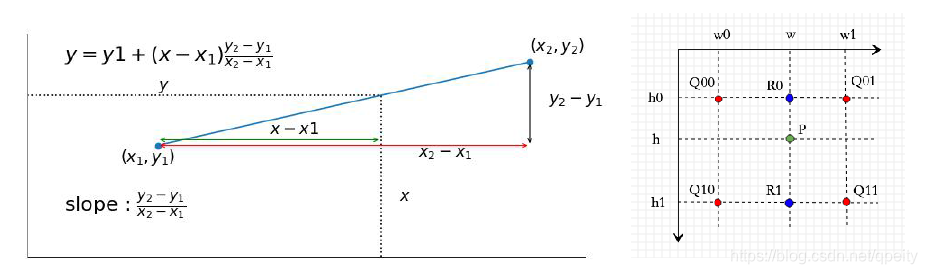
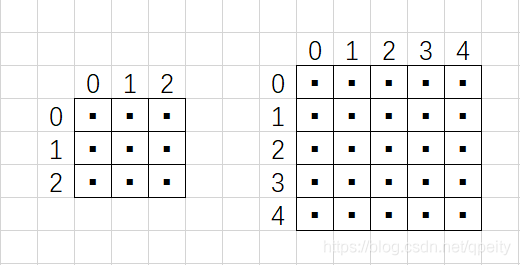
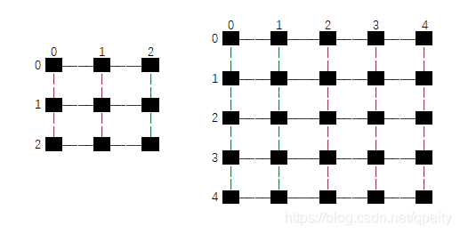
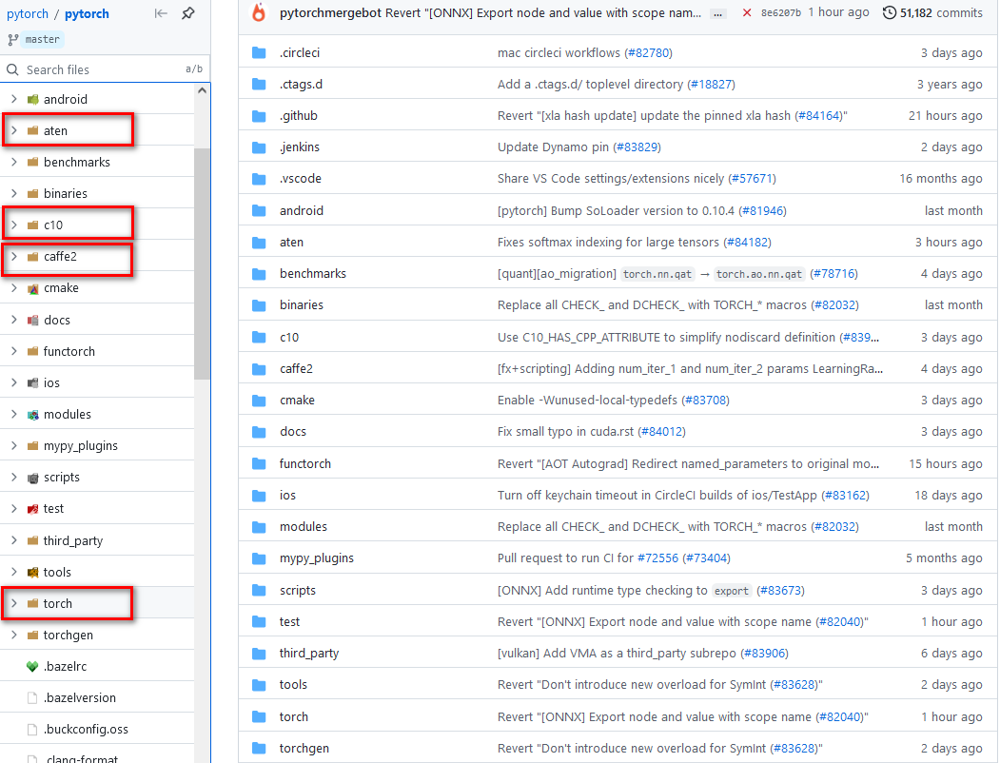
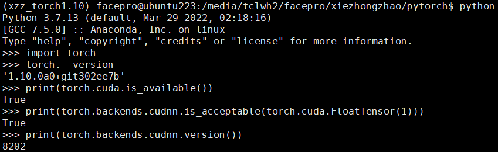

[TOC]

### 1. 任务定义

在人体检测的过程中，目前大部分新的检测算法模型都是采用pytorch框架进行训练， 但是由于MTK9652的开发板采用的是tflite方式部署（version 1.13），因此会出现算子不兼容的情况，比如upsample算子实现的方式会有差别，导致训练时精度较高，部署在板子上时精度下降严重。

解决的思路：

* 实现pytorch和tensorflow两个框架中upsample算子
* 查看两个框架的算子的差异，以tensorflow中upsample方式在pytorch框架下实现
* 阅读pytorch源码的结构和编译方式
* 在pytorch下采用扩展的方式实现upsample的C++和CUDA代码（或者直接修改源码）
* 测试pytorch扩展的算子与tensorflow的upsample算子的结果是否相同（CPU和CUDA）

### 2. 两个框架的算子具体实现

#### 2.1 双线性差值

首先一维的线性差值简单来说就是利用同一条直线的两个点来估计两点之间的未知点，因此具体方式可以用下图表示



同样的道理，在二维平面也可以采用类似的方式估计插入的点，如右图，已知四个点$Q_{00}$, $Q_{01}$, $Q_{10}$, $Q_{11}$ 的值与对应的坐标分别为$(h_0, w_0)$, $(h_0,w_1)$, $(h1,w_0)$, $(h_1,w_1)$ ，求位于$(h,w)$ 点$P$ 的值。具体思路如下：

* 先用$w$ 方向的一维线性差值，根据$Q_{00}$, $Q_{01}$ 求出点$R_0$;
* 然后通过$h$ 方向一维线性差值，根据$R_0$, $R_1$ 求出点 $P$ ;

用公式可以表示成：
$$
\begin{aligned}
R_{0} &=\frac{w_{1}-w}{w_{1}-w_{0}} Q_{00}+\frac{w-w_{0}}{w_{1}-w_{0}} Q_{01} \\
R_{1} &=\frac{w_{1}-w}{w_{1}-w_{0}} Q_{10}+\frac{w-w_{0}}{w_{1}-w_{0}} Q_{11} \\
P &=\frac{h_{1}-h}{h_{1}-h_{0}} R_{0}+\frac{h-h_{0}}{h_{1}-h_{0}} R_{1} \\
&=\frac{h_{1}-h}{\left(h_{1}-h_{0}\right)\left(w_{1}-w_{0}\right)}\left(\left(w_{1}-w\right) Q_{00}+\left(w-w_{0}\right) Q_{01}\right)+\frac{h-h_{0}}{\left(h_{1}-h_{0}\right)\left(w_{1}-w_{0}\right)}\left(\left(w_{1}-w_{0}\right) Q_{10}+\left(w-w_{0}\right) Q_{11}\right)
\end{aligned}
$$
具体到图像的双线性差值问题，可以理解成就将图片进行放大，但是不能让图像出现斑点状，而是增加图像的分辨率，多出来的像素就是双线性差值的结果。例如图像上$(h,w)$ 周边4点一定是临近的：
$$
\begin{array}{lll}
h_{0}=\lfloor h\rfloor, & h_{1}=h_{0}+1, & h_{1}-h_{0}=1 \\
w_{0}=\lfloor w\rfloor, & w_{1}=w_{0}+1, & w_{1}-w_{0}=1
\end{array}
$$
上述公式可以进行化简为
$$
\begin{aligned}
P=&\left(h_{1}-h\right)\left(w_{1}-w\right) Q_{00}+\left(h_{1}-h\right)\left(w-w_{0}\right) Q_{01}+\\
&\left(h-h_{0}\right)\left(w_{1}-w_{0}\right) Q_{10}+\left(h-h_{0}\right)\left(w-w_{0}\right) Q_{11}
\end{aligned}
$$
这样就可以将目标图像的坐标$(hd, wd)$ 映射到原图像上求出$(h,w)$ .

#### 2.2 坐标变换

将目标图像的坐标$(hd,wd)$ 映射到原图像上求出$(h,w)$ 有两种思路：

（1）第一种方式：像素点位于$1\times 1$ 大小方块中心，坐标转换时，$HW$ 方向的坐标都要加 $0.5$才能对应起来，pytorch里面对应`align_corners=False` ，假设图像大小为 $3\times 3$ 上采样为 $5\times 5$ , 每个像素点都位于方形内的黑色小点，$h_{src}, w_{src}$ 为原图像的大小 $3\times 3$ , 目标图像大小 $h_{dst}, w_{dst}$ 为 $5\times 5$, 公式换算成：
$$
\begin{aligned}
&\frac{h+0.5}{h_{s r c}}=\frac{h d+0.5}{h_{d s t}} \quad \Rightarrow \quad h=\frac{h_{s r c}}{h_{d s t}}(h d+0.5)-0.5 \\
&\frac{w+0.5}{w_{s r c}}=\frac{w d+0.5}{w_{d s t}} \quad \Rightarrow \quad w=\frac{w_{s r c}}{w_{d s t}}(w d+0.5)-0.5
\end{aligned}
$$




（2）第二种方式：像素位于上下左右相邻像素点之间连线的交点上，坐标转换时，$HW$ 方向的总长度都要减少1才能对应起来，pytorch里面对应`align_corner=True`, 假设 $3\times 3$ 图像放大到 $5\times 5$, 每个像素点都位于交点的黑色小点，$h_{src}, w_{src}$ 为原图像的大小 $3\times 3$ , 目标图像大小 $h_{dst}, w_{dst}$ 为 $5\times 5$, 计算时需要取边的长度，也就是$HW$ 方向各减1，也就是从$2\times 2$ 变成 $4\times 4$，因此变换以后目标图像四个顶点的像素值一定和原图像的四个顶点像素值一样
$$
\begin{aligned}
&\frac{h}{h_{s r c}-1}=\frac{h d}{h_{d s t}-1} \quad \Rightarrow \quad h=\frac{h_{s r c}-1}{h_{d s t}-1} h d \\
&\frac{w}{w_{s r c}-1}=\frac{w d}{w_{d s t}-1} \quad \Rightarrow \quad w=\frac{w_{s r c}-1}{w_{d s t}-1} w d
\end{aligned}
$$


#### 2.3 双线性差值实现

```python
def bilinear_interpolation_naive(src, dst_size, align_corners=False):
   """
   双线性差值的naive实现
   :param src: 源图像
   :param dst_size: 目标图像大小H*W
   :return: 双线性差值后的图像
   """
   src = src.astype(np.float)
   (src_h, src_w, src_c) = src.shape  # 原图像大小 H*W*C
   (dst_h, dst_w), dst_c = dst_size, src_c  # 目标图像大小H*W*C

   if src_h == dst_h and src_w == dst_w:  # 如果大小不变，直接返回copy
      return src.copy()

   dst = np.zeros((dst_h, dst_w, dst_c), dtype=src.dtype)  # 目标图像初始化(6, 12)
   # 将目标图像的坐标转换到源图像中计算相应的插值
   for h_d in range(dst_h):
      for w_d in range(dst_w):
         if align_corners:
             h1r = float(src_h-1) / (dst_h-1) * h_d
             w1r = float(src_w-1) / (dst_w-1) * w_d
         else:
             h1r = float(src_h)/dst_h * (h_d + 0.5) - 0.5  # 将目标图像H坐标映射到源图像上
             w1r = float(src_w)/dst_w * (w_d + 0.5) - 0.5  # 将目标图像W坐标映射到源图像上
             
         # 计算h方向相邻的位置
         h1 = int(h1r)
         h1p = 1 if (h1 < src_h-1) else 0
         h1lambda = max(0, h1r - h1)
         h0lambda = 1 - h1lambda
         
         # 计算w方向相邻的位置
         w1 = int(w1r)
         w1p = 1 if (w1 < src_w-1) else 0
         w1lambda = max(0, w1r - w1)
         w0lambda = 1 - w1lambda
         
         # 根据相邻的四点坐标，计算出插值
         r0 = w0lambda*src[h1, w1, :] + w1lambda*src[h1, w1+w1p, :]
         r1 = w0lambda*src[h1+h1p, w1, :] + w1lambda*src[h1+h1p, w1+w1p, :]
         p = h0lambda*r0 + h1lambda*r1

         dst[h_d, w_d, :] = p

   return dst
```

MTK9652的开发板采用的是tf1.13中upsample算子，与现在pytorch的upsample算子实现原理基本一致，但是实现的细节稍微有点不相同，这个不同点需要仔细阅读tensorflow和pytorch的具体实现方式，从下面不同点可以看出，直接修改pytorch源码中upsample算子比较直接，但是需要重新编译pytorch框架和相关依赖库（torchvision）, 不利于框架迁移到其他机器，另外一种方式是通过pytorch框架的扩展功能，手写upsample的正向和反向传播（C++和CUDA两个版本），下面的算子扩展的方式实现了和原生框架相同的结果，如果想修改成tensorflow中upsample的效果，将扩展的C++和CUDA代码中的方式1换成方式2即可。

```python
##### pytorch算子——————————>> 方式1
if align_corners:
    h1r = float(src_h-1) / (dst_h-1) * h_d
    w1r = float(src_w-1) / (dst_w-1) * w_d
else:
    h1r = float(src_h)/dst_h * (h_d + 0.5) - 0.5  # 将目标图像H坐标映射到源图像上
    w1r = float(src_w)/dst_w * (w_d + 0.5) - 0.5  # 将目标图像W坐标映射到源图像上
    
#### tensorflow算子--------->> 方式2
if align_corners:
    h1r = float(src_h)/dst_h * (h_d + 0.5) - 0.5  # 将目标图像H坐标映射到源图像上
    w1r = float(src_w)/dst_w * (w_d + 0.5) - 0.5  # 将目标图像W坐标映射到源图像上
else:
    h1r = float(src_h) / (dst_h) * h_d
    w1r = float(src_w) / (dst_w) * w_d
```

### 3. Pytorch源码分析和编译

编译源码的安装方式比较适合源码改动不大的情况，对pytorch的扩展和cuda编程不熟悉。

#### 3.1 源码获取

首先获取源码和对应的第三方库，第三方依赖库包含数值计算库（eigen, gemmlowp），模型转换库（onnx, onnx-tensorrt），并行训练库（gloo, nccl），QNNPACK以及绑定Python端的pybind11等等，然后用git切换对应的版本：

`git clone --recursive https://github.com/pytorch/pytorch`

`git submodule update --init --recursive`

#### 3.2 目录结构



对上述文件逐一进行说明

* aten: 目前为止，pytorch框架C++接口主要是通过aten计算张量库来实现的， aten目录下的src文件夹包含ATen（ATen核心源文件）、TH（Torch张量库）、THC（Torch CUDA张量计算库）、THCUDNN（Torch CUDA神经网络库）和THNN（Torch神经网络库）。很多张量计算相关的头文件，这些头文件定义的函数和类的主要命名空间为`::at`。

* c10:  除了ATen张量计算库外，还有一个张量计算库就是C10（Core Tensor Library），这个张量计算库存在的目的主要是为了统一PyTorch的张量计算后端代码和Caffe2的张量计算后端代码。一般情况下，因为PyTorch是基于动态图的一个框架，而Caffe2是基于静态图的一个框架，PyTorch优点在于灵活，而Caffe2有

  点在于速度快，容易部署。目前为了两个框架共享同一个底层张量计算库，ATen的一部分功能迁移到C10库中，这样两个框架使用同一套后端代码，方便训练和部署。

* caffe2：caffe2主要针对移动端设计了很多优化后的运算代码，模型融合，模型量化等等，其后端有QNNPACK等一些针对移动端的底层运算库。

* torch: 该文件夹包含是是Python核心代码和包装代码，基本就是平常我们作为太上老君炼丹时调用的接口。

#### 3.3 编译

编译环境比较重要，如果环境配置正确的话，基本上可以一键编译成功

* 首先保证的cuda和cudnn的版本与torch版本对应上（很重要）
* 然后采用`conda create -n env_name python==version` 创建虚拟环境，安装好常用的库
* 检测一下C++编译器的版本不能太低，这个需要确认一下Linux环境的版本

上述准备工作做好之后，再按照官网的步骤进行编译

（1）首先在conda虚拟环境中安装依赖库

```
conda install astunparse numpy ninja pyyaml setuptools cmake cffi typing_extensions future six requests dataclasses
conda install mkl mkl-include
conda install -c pytorch magma-cuda110
```

（2）获取pytorch源码和三方库

```
git clone --recursive https://github.com/pytorch/pytorch
cd pytorch
# if you are updating an existing checkout
git submodule sync
git submodule update --init --recursive --jobs 0
```

（3）编译安装pytorch

```
export CMAKE_PREFIX_PATH=${CONDA_PREFIX:-"$(dirname $(which conda))/../"}
python setup.py install
```

如果不使用CUDA，那边编译采用`NO_CUDA=1 python setup.py install` , 如果编译中出现失败情况，`python setup.py clean`清除之前的编译结果， 编译完成后为了方便python开发，执行指令`python setup.py develop && python -c "import torch"`。特别说明一下，torchvision也需要通过源码的方式进行安装（版本与torch对应上）。

#### 3.4 测试

编译安装完成之后，测试是否是你编译的版本，调用cuda, cudnn是否正常：



### 4. Pytorch算子扩展

接下来扩展一个比较简单的算子GELU作为例子，来解释算子扩展的整个流程，算子扩展采用pybind11构建共享库形式的C++和CUDA扩展，这样方式性能高并且适合部署，我们设计一个全新的底层算子大概分为三步：

第一步：使用C++编写算子的forward函数和backward函数

第二步：将算子的forward和backward函数使用pybind11绑定在python上

第三步：使用setuptools/JIT/CMake编译打包C++工程的so文件

接下来我们尝试扩展常用的GELU激活算子： $GELU(x)=x\times\sigma(1.702x)$ ，其中$\sigma$ 为Sigmoid函数，反向传播的前提需要先知道GELU算子的导数为
$$
GELU'(x)=\sigma(1.702x)+1.702x\sigma(1.702x)(1-\sigma(1.702x))
$$
首先使用C++编写源文件`gelu.cc`

```c++
#include <torch/torch.h>
torch::Tensor gelu_fwd(torch::Tensor input){
    return input * torch::sigmoid(1.702*input);
}

torch::Tensor gelu_bwd(torch::Tensor grad_out, torch::Tensor input){
    auto tmp = torch::sigmoid(1.702*input);
    reutrn grad_out * (tmp+1.702*input*tmp*(1.0-tmp));
}

PYBIND11_MOUDLE(TORCH_EXTENSION_NAME, m){
    m.def("forward", &gelu_fwd, "GELU forward"); 
    m.def("backward", &gelu_bwd, "GELU backward");
}
```

上述注册函数def有三个函数，第一个参数是python调用的名字，第二个参数是C++中函数指针， 第三个参数是函数的帮助说明。

接下来需要对C++代码进行编译和安装`python setup.py install`，具体的`setup.py`代码如下：

```python
from setuptools import setup, Extension
from torch.utils import cpp_extension
setup(name='gelu', 
     ext_modules=[cpp_extension.CPPExtension('gelu', ['gelu.cc'])],
     cmdclass={'build_ext': cpp_extension.BuildExtension})
```

在安装后调用算子代码：

```python
import torch
import gelu

# gelu = GELU.apply使用这个函数
class GELU(torch.autograd.Function):
    @staticmethod
    def forward(ctx, input):
        ctx.input = input
        return gelu.forward(input)
    @staticmethod
    def backward(ctx, grad_output)
    	input = ctx.input
        return gelu.backward(grad_output, input)
```

但是上述中安装方式，不便于代码调试，不够灵活，所以一般采用动态编译方法（JIT）进行安装调用

```python
import torch
from torch.utils.cpp_extension import load

# pytorch自动编译，生成对应的模块
gelu = load(name="gelu", sources=["gelu.cc"])

class GELU(torch.autograd.Function):
    @staticmethod
    def forward(ctx, input):
        ctx.input = input
        return gelu.forward(input)
    @staticmethod
    def backward(ctx, grad_output)
    	input = ctx.input
        return gelu.backward(grad_output, input)
```

上述代码都是在cpu上运行的，很多时候需要编写运行在CUDA上的代码`gelu_kernel.cu`，动态编译时将`gelu_kernel.cu`添加在上述加载函数里面`gelu = load(name="gelu", sources=["gelu.cc", "gelu_kernel.cu"])`（[CUDA编写参考官网](https://docs.nvidia.com/cuda/cuda-c-programming-guide/index.html)）：

```c++
#include <cuda.h>
#include <cuda_runtime.h>

#define BLOCKSIZE 1024

__device__ float sigmoid(float x) {
    return 1.0/(1+expf(-x));
}

__global__ void gelu_fwd_cuda(float* input, float* ret,
                              int64_t size) {
    int64_t idx = threadIdx.x + blockIdx.x*blockDim.x;
    if(idx < size) {
        ret[idx] = input[idx]*sigmoid(1.702*input[idx]);
    }
}

__global__ void gelu_bwd_cuda(float* grad_out, float* input,
                              float* ret, int64_t size) {
    int64_t idx = threadIdx.x + blockIdx.x*blockDim.x;
    if(idx < size) {
        float tmp = sigmoid(1.702*input[idx]);
        ret[idx] = grad_out[idx]*(tmp + 1.702*input[idx]*tmp*(1-tmp));
    }
}

__host__ void gelu_fwd_interface(float* input, float* ret, int64_t size) {
    int64_t nblock = (size + BLOCKSIZE - 1)/BLOCKSIZE;
    gelu_fwd_cuda<<<nblock, BLOCKSIZE>>>(input, ret, size);
}

__host__ void gelu_bwd_interface(float* grad_out, float* input, float* ret,
                        int64_t size) {
    int64_t nblock = (size + BLOCKSIZE - 1)/BLOCKSIZE;
    gelu_bwd_cuda<<<nblock, BLOCKSIZE>>>(grad_out, input,
                                         ret, size);
}

```

最后将gelu.cc添加cuda调用的代码，结果如下：

```c++
#include <torch/extension.h>

void gelu_fwd_interface(float*, float*, int64_t);
void gelu_bwd_interface(float*, float*, float*, int64_t);

torch::Tensor gelu_fwd(torch::Tensor input) {
    if(input.device().type() == torch::kCPU) {
        return input*torch::sigmoid(1.702*input);
    } else if (input.device().type() == torch::kCUDA){
        TORCH_CHECK(input.dtype() == torch::kFloat32,
            "Datatype not implemented");
        auto ret = torch::zeros_like(input);
        int64_t size = ret.numel();
        gelu_fwd_interface(input.data_ptr<float>(),
                           ret.data_ptr<float>(), size);
        return ret;
    }
    AT_ERROR("No such device: ", input.device());
}

torch::Tensor gelu_bwd(torch::Tensor grad_out, torch::Tensor input) {
    if(input.device().type() == torch::kCPU) {
        auto tmp = torch::sigmoid(1.702*input);
        return grad_out*(tmp+1.702*input*tmp*(1.0-tmp));
    } else if (input.device().type() == torch::kCUDA){
        TORCH_CHECK(input.dtype() == torch::kFloat32,
            "Datatype not implemented");
        TORCH_CHECK(grad_out.dtype() == torch::kFloat32,
            "Datatype not implemented");
        auto ret = torch::zeros_like(input);
        int64_t size = ret.numel();
        gelu_bwd_interface(grad_out.data_ptr<float>(),
                           input.data_ptr<float>(),
                           ret.data_ptr<float>(), size);
        return ret;
    }
    AT_ERROR("No such device: ", input.device());
}

PYBIND11_MODULE(TORCH_EXTENSION_NAME, m) {
  m.def("forward", &gelu_fwd, "GELU forward");
  m.def("backward", &gelu_bwd, "GELU backward");
}

```

####  4.1 双线性算子前向推理cpu和cuda版本

（1）双线性的算子前向推理实现方式：前向推理的C++代码有很多可以优化的空间（指令集优化，多线程，缓存优化等等），这里为了方便理解所以写成naive形式，与上述python的实现思路基本一致。

```c++
at::Tensor upsample_fwd(at::Tensor& input,
                        const bool align_corners,
                        const int scale){
    if(input.device().type() == c10::DeviceType::CPU){
        int batch = input.size(0);
        int channels = input.size(1);
        int src_h = input.size(2);
        int src_w = input.size(3);
        int dst_h = scale * src_h;
        int dst_w = scale * src_w;

        if((src_h == dst_h) && (src_w == dst_w))
            return input;

        auto bench = std::chrono::steady_clock::now();
        auto dst = at::zeros({batch, channels, dst_h, dst_w});
        for(int n=0; n<batch; ++n){
            for(int c=0; c<channels; ++c){
                for(int h_d=0; h_d<dst_h; ++h_d){
                    for(int w_d=0; w_d<dst_w; ++w_d){
                        float h1r=0.0, w1r=0.0;
                        if(align_corners){
                            h1r = float(src_h-1)/(dst_h-1)*h_d;
                            w1r = float(src_w-1)/(dst_w-1)*w_d;
                        }else{
                            h1r = float(src_h)/dst_h*(h_d+0.5)-0.5;
                            w1r = float(src_w)/dst_w*(w_d+0.5)-0.5;
                        }

                        // calculate the neighbor in vertical(h) direction
                        int h1 = int(h1r);
                        int h1p = (h1<src_h-1) ? 1 : 0;
                        float  h1lambda = (h1r-h1)>0 ? h1r-h1 : 0;
                        float h0lambda = 1.0 - h1lambda;

                        // calculate the neighbor in horizontal(w) direction
                        int w1 = int(w1r);
                        int w1p = (w1<src_w-1) ? 1 : 0;
                        float w1lambda = (w1r-w1)>0 ? w1r-w1 : 0;
                        float w0lambda = 1.0 - w1lambda;

                        // calculate the interpolation from the adjacent points
                        float r0 = w0lambda*input[n][c][h1][w1].item().to<float>() + \
                                   w1lambda*input[n][c][h1][w1+w1p].item().to<float>();
                        float r1 = w0lambda*input[n][c][h1+h1p][w1].item().to<float>() + \
                                   w1lambda*input[n][c][h1+h1p][w1+w1p].item().to<float>();
                        float p = h0lambda*r0 + h1lambda*r1;

                        dst[n][c][h_d][w_d] = p;
                    }
                }
            }
        }
        printf("forward cpu: %lfs\n", std::chrono::duration_cast<std::chrono::duration<double>>(std::chrono::steady_clock::now() - bench).count());
        return dst;
   }
   else if(input.device().type() == c10::DeviceType::CUDA){
        TORCH_CHECK(input.dtype() == torch::kFloat32, "Datatype not implemented");
        int batch = input.size(0);
        int channels = input.size(1);
        int src_h = input.size(2);
        int src_w = input.size(3);
        int dst_h = scale * src_h;
        int dst_w = scale * src_w;

        if((src_h == dst_h) && (src_w == dst_w))
            return input;

        int n_s = batch * channels * src_h * src_w; // elements of the input
        int n_d = batch * channels * dst_h * dst_w; // elements of the output

        float* input_cpu = input.data_ptr<float>();
        auto output = at::zeros({batch, channels, dst_h, dst_w});
        float* output_cpu = output.data_ptr<float>();

        auto bench = std::chrono::steady_clock::now();
        output_cpu = upsample_fwd_interface(batch, channels,
                                            src_h, src_w,
                                            dst_h, dst_w,
                                            input_cpu, output_cpu,
                                            align_corners, n_d);
        printf("forward cuda: %lfs\n",
                std::chrono::duration_cast<std::chrono::duration<double>>
                (std::chrono::steady_clock::now() - bench).count());

        for(int n=0; n<batch; ++n){
            for(int c=0; c<channels; ++c){
                for(int h=0; h<dst_h; ++h){
                    for(int w=0; w<dst_w; ++w){
                        float val = output_cpu[n*channels*dst_h*dst_w + \
                                                   c*dst_h*dst_w+ \
                                                   h*dst_w+ w];
                        output[n][c][h][w] = val;
                    }
                }
            }
        }
        return output;
   }
   AT_ERROR("No such device: ", input.device());
}
```

（2）前向推理cuda代码：cuda并行加速大致分为内存（GPU）申请，数据初始化，kernel的执行配置，设备同步，释放内存五大步骤，可以参考这篇[高赞知乎文章](https://zhuanlan.zhihu.com/p/34587739)。

```C++
#define CUDA_1D_KERNEL_LOOP(i,n) \
    for(int32_t i = blockIdx.x*blockDim.x+threadIdx.x; i < (n); \
        i += blockDim.x*gridDim.x)

__global__ void upsample_bilinear2d_forward(const int batch_size,
                                            const int channels,
                                            const int src_h,
                                            const int src_w,
                                            const int dst_h,
                                            const int dst_w,
                                            float* input,
                                            float* output,
                                            bool align_corners,
                                            int n_size){

    const int index = blockIdx.x * blockDim.x + threadIdx.x;
    //CUDA_1D_KERNEL_LOOP(index, n_size)
    if(index < n_size)
    {
        // index of output matrix
        const int c = index % channels;
        const int h_d = (index / channels) % dst_w;
        const int w_d = (index / channels / dst_w) % dst_h;
        const int n = index / channels / dst_w / dst_h;

        float h1r = 0.0, w1r = 0.0;
        if(align_corners){
            h1r = float(src_h-1)/(dst_h-1)*h_d;
            w1r = float(src_w-1)/(dst_w-1)*w_d;
        }
        else{
            h1r = float(src_h)/dst_h*(h_d+0.5)-0.5;
            w1r = float(src_w)/dst_w*(w_d+0.5)-0.5;
        }

        // horizontal direction
        int h1 = int(h1r);
        int h1p = (h1<src_h-1) ? 1 : 0;
        float h1lambda = (h1r-h1)>0 ? h1r-h1 : 0;
        float h0lambda = 1.0 - h1lambda;

        // vertical direction
        int w1 = int(w1r);
        int w1p = (w1<src_w-1) ? 1 : 0;
        float w1lambda = (w1r-w1)>0 ? w1r-w1 : 0;
        float w0lambda = 1.0 - w1lambda;

        // parallel
        float r0 = w0lambda * input[n*(channels*src_w*src_h) + c*(src_w*src_h) + h1*src_w + w1] + \
                   w1lambda * input[n*(channels*src_w*src_h) + c*(src_w*src_h) + h1*src_w + (w1+w1p)];
        float r1 = w0lambda * input[n*(channels*src_w*src_h) + c*(src_w*src_h) + (h1+h1p)*src_w + w1] + \
                   w1lambda * input[n*(channels*src_w*src_h) + c*(src_w*src_h) + (h1+h1p)*src_w + (w1+w1p)];
        float val = h0lambda * r0 + h1lambda * r1;

        output[n*(channels*dst_w*dst_h) + c*(dst_w*dst_h) + h_d*dst_w + w_d] = val;
    }

}
```

#### 4.2 双线性算子反向传播cpu和cuda版本

（1）双线性算子反向传播实现方式：这里解释一下upsample算子方向传播的方式，假设上一层反向传播的结果为$\text grad\_out$ ，$x$为输入值，$f(x)$ 为upsample函数，upsample的导数为$f'(x)$，因此可以推导出upsample反向传播的结果为上一层反向传播的结果乘以当前层的导数： $\text grad\_out * f'(x)$ 。upsample的导数求解方式与激活函数gelu的方式有很大的不同，接下来具体说说upsample的导数求解方式：

```python
r0 = w0lambda*src[h1, w1, :] + w1lambda*src[h1, w1+w1p, :]  ## horizontal
r1 = w0lambda*src[h1+h1p, w1, :] + w1lambda*src[h1+h1p, w1+w1p, :] ## horizontal
p = h0lambda*r0 + h1lambda*r1 ## vertical

dst[h_d, w_d, :] = p
```

src代表的是源图像，dst代表的是目标图像，目标图像的值为源图像相邻四个值（左上角，右上角，左下角，右下角）加权总和，四个权重分别为$w0lambda * h0lambda$，$w1lambda * h0lambda$ $w0lambda * h1lambda$ $w1lambda * h1lambda$，可以推导出反向传播过程中，源图像一个像素点 $x$ 对应目标图像多个值（$scale_h*scale_w$），那么假设左上角的 $x$ 对应的梯度为$n*w0lambda*h0lambda$ ，其中 $n$ 代表的是目标图像投射到左上角像素的个数，$w0lambda * h0lambda$ 为左上角的梯度，其他三个点原理一样，这样就可以求解出upsample的导数$f'(x)$，最后与$\text grad\_out$ 相乘得到反向传播的结果。

```c++
at::Tensor upsample_bwd(at::Tensor& grad_output,
                        at::Tensor& input,
                        const bool align_corners,
                        const int scale){

    if(grad_output.device().type() == c10::DeviceType::CPU){

        int batch = grad_output.size(0);
        int channels = grad_output.size(1);
        int dst_h = grad_output.size(2);
        int dst_w = grad_output.size(3);

        int src_h = dst_h / scale;
        int src_w = dst_w / scale;

        if((src_h == dst_h) && (src_w == dst_w))
            return grad_output;

        auto bench = std::chrono::steady_clock::now();
        auto grad_input = at::zeros({batch, channels, src_h, src_w});
        for(int n=0; n<batch; ++n){
            for(int c=0; c<channels; ++c){
                for(int h_d=0; h_d<dst_h; ++h_d){
                    for(int w_d=0; w_d<dst_w; ++w_d){
                        float h1r=0.0, w1r=0.0;
                        if(align_corners){
                            h1r = float(src_h-1)/(dst_h-1)*h_d;
                            w1r = float(src_w-1)/(dst_w-1)*w_d;
                        }else{
                            h1r = float(src_h)/dst_h*(h_d+0.5)-0.5;
                            w1r = float(src_w)/dst_w*(w_d+0.5)-0.5;
                        }

                        // calculate the neighbor in vertical(h) direction
                        int h1 = int(h1r);
                        int h1p = (h1<src_h-1) ? 1 : 0;
                        float  h1lambda = (h1r-h1)>0 ? h1r-h1 : 0;
                        float h0lambda = 1.0 - h1lambda;

                        // calculate the neighbor in horizontal(w) direction
                        int w1 = int(w1r);
                        int w1p = (w1<src_w-1) ? 1 : 0;
                        float w1lambda = (w1r-w1)>0 ? w1r-w1 : 0;
                        float w0lambda = 1.0 - w1lambda;

                        float val = grad_output[n][c][h_d][w_d].item().to<float>();
                        grad_input[n][c][h1][w1] += (h0lambda*w0lambda)*val;
                        grad_input[n][c][h1][w1+w1p] += (h0lambda*w1lambda)*val;
                        grad_input[n][c][h1+h1p][w1] += (h1lambda*w0lambda)*val;
                        grad_input[n][c][h1+h1p][w1+w1p] += (h1lambda*w1lambda)*val;

                    }
                }
            }
        }
        printf("backward cpu: %lfs\n", std::chrono::duration_cast<std::chrono::duration<double>>(std::chrono::steady_clock::now() - bench).count());
        return grad_input;
    }
    else if(grad_output.device().type() == c10::DeviceType::CUDA){
        TORCH_CHECK(grad_output.dtype() == torch::kFloat32, "Datatype not implemented");

        int batch = grad_output.size(0);
        int channels = grad_output.size(1);
        int dst_h = grad_output.size(2);
        int dst_w = grad_output.size(3);

        int src_h = dst_h / scale;
        int src_w = dst_w / scale;

        if((src_h == dst_h) && (src_w == dst_w))
            return grad_output;

        int n_s = batch * channels * src_h * src_w; // elements of the output
        int n_d = batch * channels * dst_h * dst_w; // elements of the output

        auto grad_input = at::zeros({batch, channels, src_h, src_w});
        float* grad_out = grad_output.data_ptr<float>();
        float* grad_in = grad_input.data_ptr<float>();

        auto bench = std::chrono::steady_clock::now();
        grad_in = upsample_bwd_interface(batch, channels,
                                        src_h, src_w,
                                        dst_h, dst_w,
                                        grad_out, grad_in,
                                        align_corners, n_d);
        printf("backward cuda: %lfs\n",
                std::chrono::duration_cast<std::chrono::duration<double>>
                (std::chrono::steady_clock::now() - bench).count());

        for(int n=0; n<batch; ++n){
            for(int c=0; c<channels; ++c){
                for(int h=0; h<src_h; ++h){
                    for(int w=0; w<src_w; ++w){
                        float val = grad_in[n*channels*src_h*src_w + \
                                            c*src_h*src_w + \
                                            h*src_w + w];
                        grad_input[n][c][h][w] = val;
                    }
                }
            }
        }

        return grad_input;
    }
    AT_ERROR("NO such device: ", grad_output.device());
}

```


（2）反向传播cuda实现方式：反向传播cuda编程中要注意源图像中每一个像素点对应四个梯度值的累加和，因此在并行计算过程中采用原子的方式进行处理。

```c++
__global__ void upsample_bilinear2d_backward(const int batch,
                                             const int channels,
                                             const int src_h,
                                             const int src_w,
                                             const int dst_h,
                                             const int dst_w,
                                             float* grad_out,
                                             float* grad_in,
                                             const bool align_corners,
                                             const int n_size){

    const int index = blockIdx.x * blockDim.x + threadIdx.x;
    //CUDA_1D_KERNEL_LOOP(index, n_size)
    if(index < n_size)
    {
        // index of output matrix
        const int c = index % channels;
        const int h_d = (index / channels) % dst_w;
        const int w_d = (index / channels / dst_w) % dst_h;
        const int n = index / channels / dst_w / dst_h;

        float h1r = 0.0, w1r = 0.0;
        if(align_corners){
            h1r = float(src_h-1)/(dst_h-1)*h_d;
            w1r = float(src_w-1)/(dst_w-1)*w_d;
        }
        else{
            h1r = float(src_h)/dst_h*(h_d+0.5)-0.5;
            w1r = float(src_w)/dst_w*(w_d+0.5)-0.5;
        }

        // horizontal direction
        int h1 = int(h1r);
        int h1p = (h1<src_h-1) ? 1 : 0;
        float h1lambda = (h1r-h1)>0 ? h1r-h1 : 0;
        float h0lambda = 1.0 - h1lambda;

        // vertical direction
        int w1 = int(w1r);
        int w1p = (w1<src_w-1) ? 1 : 0;
        float w1lambda = (w1r-w1)>0 ? w1r-w1 : 0;
        float w0lambda = 1.0 - w1lambda;

        // parallel
        float val_out = grad_out[n*(channels*dst_w*dst_h) + c*(dst_w*dst_h) + h_d*dst_w + w_d];
        atomicAdd(&grad_in[n*(channels*src_w*src_h) + c*(src_w*src_h) + h1*src_w + w1],
                  h0lambda * w0lambda * val_out);

        atomicAdd(&grad_in[n*(channels*src_w*src_h) + c*(src_w*src_h) + h1*src_w + (w1+w1p)],
                  h0lambda * w1lambda * val_out);

        atomicAdd(&grad_in[n*(channels*src_w*src_h) + c*(src_w*src_h) + (h1+h1p)*src_w + w1],
                  h1lambda * w0lambda * val_out);

        atomicAdd(&grad_in[n*(channels*src_w*src_h) + c*(src_w*src_h) + (h1+h1p)*src_w + (w1+w1p)],
                  h1lambda * w1lambda * val_out);

    }
}

__host__ float* upsample_bwd_interface(const int batch,
                                     const int channels,
                                     const int src_h,
                                     const int src_w,
                                     const int dst_h,
                                     const int dst_w,
                                     float* grad_output,
                                     float* grad_input,
                                     bool align_corners,
                                     int n_s){
    int threadNum = getThreadNum();
    int blockNum = (n_s + threadNum - 1) / threadNum;

    n_s = batch * channels * src_h * src_w; // elements of the grad_input
    int n_d = batch * channels * dst_h * dst_w; // elements of the grad_output
    int n_weight = batch * channels * src_h * src_w * dst_h * dst_w;

    float* grad_out;
    float* grad_in;
    //float* grad_weight;
    HANDLE_ERROR(cudaMalloc((void**)&grad_out, n_d*sizeof(float))); // allocate the memory in cuda
    HANDLE_ERROR(cudaMalloc((void**)&grad_in, n_s*sizeof(float)));

    // move the data from host to device(cuda)
    HANDLE_ERROR(cudaMemcpy(grad_out, grad_output, n_d*sizeof(float), cudaMemcpyHostToDevice));

    //TICK(upsample_bilinear2d_backward);
    upsample_bilinear2d_backward<<<blockNum, threadNum, 0, at::cuda::getCurrentCUDAStream()>>>(batch, channels,
                                                          src_h, src_w,
                                                          dst_h, dst_w,
                                                          grad_out, grad_in,
                                                          align_corners, n_d);
    cudaDeviceSynchronize();
    //TOCK(upsample_bilinear2d_backward);

    float* res = new float[n_s];
    // move the result from device(cuda) to host
    HANDLE_ERROR(cudaMemcpy(res, grad_in, n_s*sizeof(float), cudaMemcpyDeviceToHost));

    cudaFree(grad_out);
    cudaFree(grad_in);
    return res;
}
```


### 5. 测试Pytorch算子

测试算子的精度是否满足要求有两种方法，第一种方法是与pytorch原生算子的前向和后向结果进行对比，第二种方式是通过自动梯度求解的方法。

（1）自定义双线性算子和原生双线性算子的测试结果对比（测试结果满足要求）：

```python
import os
import torch
import torch.nn as nn
import numpy as np
from torch.utils.cpp_extension import load
upsample = load(name="upsample", sources=["operators/upsample.cc", "operators/upsample_kernel.cu"])

class UpsampleFunction(torch.autograd.Function):
    @staticmethod
    def forward(ctx, input, align_corners, scale):
        ctx.input = input
        ctx.align_corners = align_corners
        ctx.scale = scale
        return upsample.forward(input, align_corners, scale)

    @staticmethod
    def backward(ctx, grad_output):
        input = ctx.input
        align_corners = ctx.align_corners
        scale = ctx.scale
        output = upsample.backward(grad_output, input, align_corners, scale)
        return output, None, None

# a = torch.randn((1, 1, 64, 64))
# b = UpsampleFunction.apply(a, False, 2)

up = nn.Upsample(scale_factor=2, mode='bilinear', align_corners=False).cuda()
x = torch.rand(1,1,32,32).cuda()
x.requires_grad = True
x.retain_grad()
y = up(x)
y_grad = torch.rand_like(y).cuda()
y.backward(y_grad)

z = upsample.forward(x, False, 2)
grad = upsample.backward(y_grad, x, False, 2)
print("torch grad: \n", x.grad)
print("mytorch grad: \n", grad)
print("grad.shape: ", grad.shape)

print("forward: ", np.linalg.norm(y.detach().cpu().numpy() - z.detach().cpu().numpy()))
print("backward: ", np.linalg.norm(grad.detach() - x.grad.detach().numpy()))

##### the difference between the original upsample and my upsample
##### forward:  1.2669493e-06
##### backward: 5.6174017e-06

```

（2）自动梯度求解

```python
import os
import torch
import torch.nn as nn
import numpy as np
from torch.utils.cpp_extension import load
upsample = load(name="upsample", sources=["gelu/upsample.cc", "gelu/upsample_kernel.cu"])

class UpsampleFunction(torch.autograd.Function):
    @staticmethod
    def forward(ctx, input, align_corners, scale):
        ctx.input = input
        ctx.align_corners = align_corners
        ctx.scale = scale
        return upsample.forward(input, align_corners, scale)

    @staticmethod
    def backward(ctx, grad_output):
        input = ctx.input
        align_corners = ctx.align_corners
        scale = ctx.scale
        output = upsample.backward(grad_output, input, align_corners, scale)
        return output, None, None
    
a = torch.randn((1,1,32,32), requires_grad=True, dtype=torch.float32) # 
flag = torch.autograd.gradcheck(UpsampleFunction.apply, (a, False, 2), eps=1e-3)
print("flag: ", flag) # flag: True
```

### 6. 附录

[实例：手写 CUDA 算子，让 Pytorch 提速 20 倍（某特殊算子）](https://zhuanlan.zhihu.com/p/476297195)

[CUDA编程入门极简教程](https://zhuanlan.zhihu.com/p/34587739)

[[一网打尽CNN前向和反向] — 双线性插值](https://zhuanlan.zhihu.com/p/372656896)

[扩展Pytorch：实现自定义算子（一）](https://zhuanlan.zhihu.com/p/350651297)

[三分钟教你如何PyTorch自定义反向传播](https://zhuanlan.zhihu.com/p/359524837)


